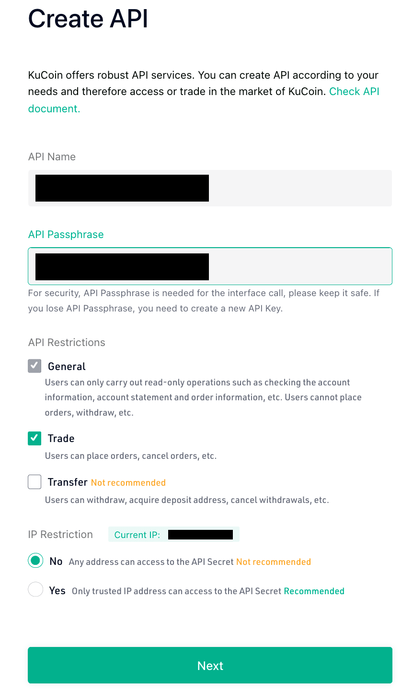

KuCoin has become officially supported by PumpOlymp Bot.

To set it up, you will need to obtain from KuCoin:
- **API Key**
- **API Secret**
- **API Passphrase** (you should assign it when you first sign up for KuCoin)

Go to [https://www.kucoin.com/account/api](https://www.kucoin.com/account/api)

Click **Create API** button.

Fill out the Create API form

Make sure you have selected the **Trade** checkbox.
Also, better select **No** for IP Restriction unless you are sure you have a static IP address.

Then, fill out the **Security Verification** form using your e-mail and Google Authenticator.

You should get an **API Created!** popup window with your **API Key** and **API Secret**.

Now that you have all the required KuCoin credentials, please proceed to [https://pumpolymp.com/bot/settings/api-keys](https://pumpolymp.com/bot/settings/api-keys)

Enter your API Key in the left field and API Secret:API Passphrase in the right field. (Please make sure you've put a colon (**:**) between your API Secret and API Passphrase).

This assumes you have already set up PumpOlymp Bot. In case you haven't, please read how to do it [here](https://pumpolymp.com/bot/info).

**URGENT** [EXPIRES on November 10]:

To celebrate adding KuCoin, PumpOlymp gives you a whopping **20% discount**.
Use promo code **KUCOIN** to get it.

Enjoy your profits on KuCoin!
Happy pumping!