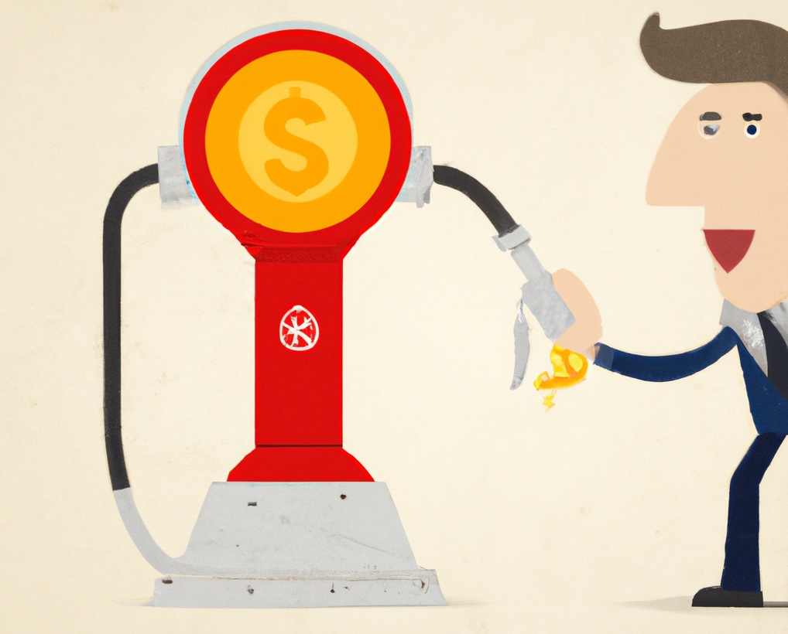

**Crypto pump and dumps** are a highly debated topic in the world of cryptocurrency. On one hand, they can be seen as a way for investors to make **quick profits** by buying into a cryptocurrency at a low price and then selling it at a higher price once the value has been artificially inflated. On the other hand, they can also be seen as unethical and potentially harmful to the overall health of the cryptocurrency market.

Regardless of your personal stance on the matter, it is undeniable that crypto pump and dumps have become an integral part of the crypto trading landscape. And for those who are able to navigate the sometimes-treacherous waters of these events, the potential **rewards can be significant**.

One of the biggest advantages of crypto pump and dumps is their **speed**. Unlike traditional forms of investment, which can take weeks or even months to show a return, crypto pump and dumps can often produce profits within a matter of hours. This means that investors who are able to quickly identify and act on opportunities can potentially see significant returns on their investments in a relatively short period of time.

Another advantage of crypto pump and dumps is their accessibility. Unlike other forms of investment, which can be difficult for the average person to get involved in, crypto pump and dumps are open to anyone with an internet connection and a willingness to take a risk. This means that even those with limited investment experience or capital can potentially take part and reap the rewards.

Of course, it is important to remember that crypto pump and dumps can be highly volatile and risky. As with any form of investment, it is crucial to thoroughly research and carefully evaluate any potential opportunities before committing any funds. It is also important to never invest more than you can afford to lose, and to always be prepared for the possibility of significant losses.

Despite the risks, however, the potential rewards of crypto pump and dumps make them an attractive option for many investors. And as the cryptocurrency market continues to grow and evolve, it is likely that these events will only become more prevalent and potentially even more lucrative. For those who are willing to take the risk, the potential rewards of participating in a crypto pump and dump can be significant.
