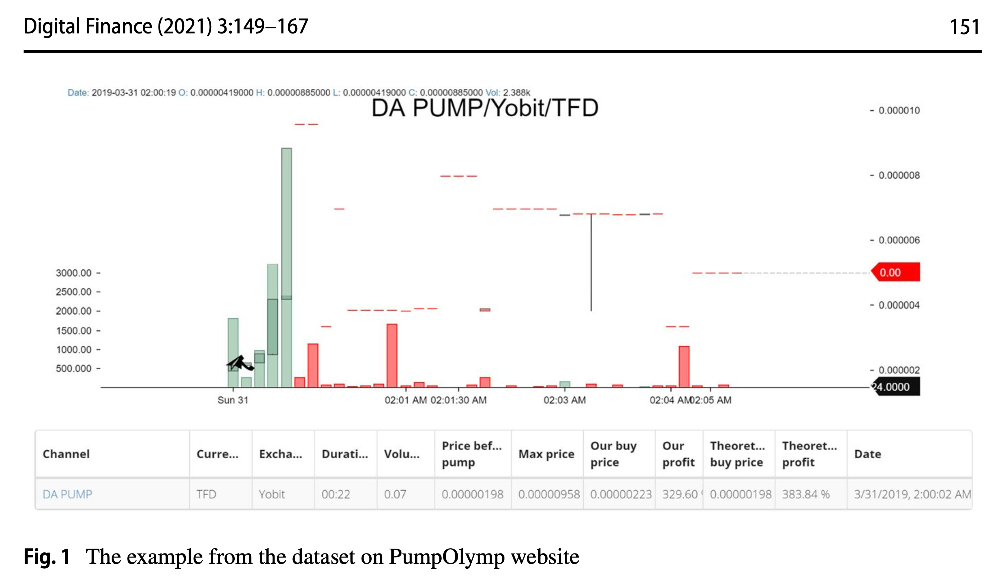
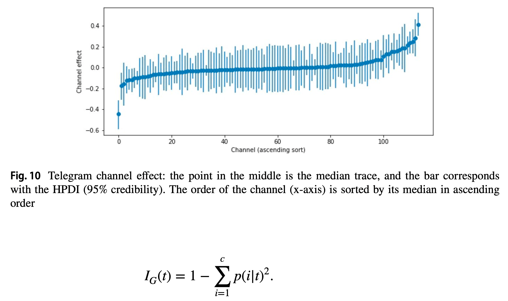

Taro Tsuchiya from **Keio University**, Tokyo, Japan built a classification model that succeeded in predicting more than **75%** of the successful and unsuccessful pumps (out-of-sample) using information before the pump occurs.

    <em>Successful pump example from PumpOlymp shown in the article.

> The sudden increase in buy orders (green) after the start of the pump. Its price went up more than the **300%** within **22 s**.
>
> <cite>Taro Tsuchiya, “Profitability of cryptocurrency Pump and Dump schemes,” 2021, page 4.</cite>

</em>

The researcher starts with describing the nature of pump and dumps, illustrating with the recent (2021) GameStop bubble example.

They compare traditional and cryptocurrency pumps. Taro Tsuchiya mentions that the majority of the cryptocurrency pumps are organized via Telegram.

General process of each crypto pump is described further.

    <a title="Li, T., Shin, D., & Wang, B. (2019). Cryptocurrency pump-and-dump schemes. Available at SSRN 3267041.">
        The article cited by Taro Tsuchiya
    </a>
    emphasizes that it's important to buy within the first 20 seconds of a pump.

The data used in the research is retrieved from PumpOlymp:
> In this experiment, the data are **retrieved from the PumpOlymp website**, which continuously lists the P&D activities by monitoring the Telegram channels and records each activity, including unsuccessful pumps (when the market did not react). Historical pump information is **only available for premium members** ($49 per 30 days). One of the related research, Xu and Livshits (2019), also aggregated their data from this website. Though the dataset only covers the case in Telegram (not the cases in Discord), the number of P&D in Discord has been small in general (Dha- wan and Putniņš, 2020). There are 1222 P&D schemes recorded spanning from July 17th, 2018 to March 31st, 2021. All the coins in this dataset are paired with Bitcoin in the cryptocurrency exchange, so transactions are usually made immediately. The dataset includes the date of the pump, pumped coins, Telegram channels, starting time, starting price, exchange, duration, volume, and theoretical profits.
>
> <cite>Taro Tsuchiya, “Profitability of cryptocurrency Pump and Dump schemes,” 2021, page 6.</cite>

All the parameters (e.g. duration, volume) are described in detail.

Later on, the author builds machine learning models based on the data from PumpOlymp: 
> The statistical model will be constructed to examine which variables are significant for the profitability of P&D in a Bayesian architecture. Moreover, to give predictions of P&D success rate, other classification models using tree-based machine learning algorithms will be built.
>
> <cite>Taro Tsuchiya, “Profitability of cryptocurrency Pump and Dump schemes,” 2021, page 12.</cite>

The researcher concludes:

> The classification model succeeded in predicting more than **75%** of the successful and unsuccessful pumps (out-of-sample) using information before the pump occurs.
> Although P&D has a short history in cryptocurrency markets, it is attractive for investors due to the **inconceivable scale of returns**.
>
> <cite>Taro Tsuchiya, “Profitability of cryptocurrency Pump and Dump schemes,” 2021, page 6.</cite>

The referenced article: <a href="https://link.springer.com/content/pdf/10.1007/s42521-021-00034-6.pdf" target="_blank" rel="noopener noreferrer">Taro Tsuchiya **Keio University**, Tokyo, Japan, “Profitability of cryptocurrency Pump and Dump schemes,” 2021</a>