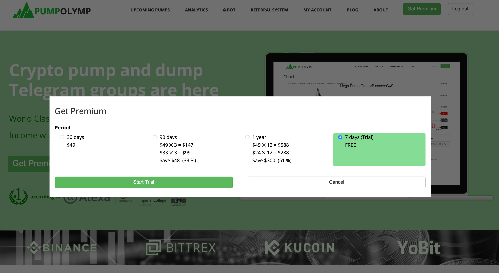
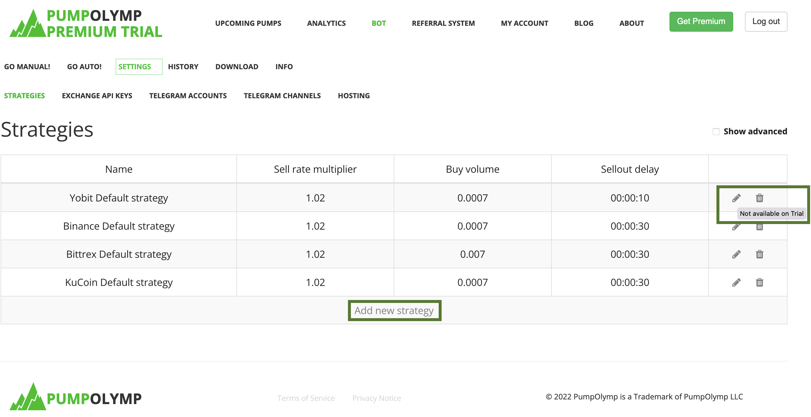

Great news! You can now use all the Premium features for free!

Click the Get Premium button. In the popup window, select 7 days (free).

Click **Start Trial** button.

You can now see all the analytics, including the [full pump history](https://pumpolymp.com/analytics/all-pumps).

If you are a developer or a researcher, you might be interested in the raw JSON data, which you can found [here](https://pumpolymp.com/api/PumpMarketHistory/raw). (It may take about 5 minutes to download since the file is huge).

To set up the PumpOlymp Bot,
1. Dowload the **pumpolymp-bot.zip** archive from [https://pumpolymp.com/bot/download](https://pumpolymp.com/bot/download)
2. Extract the whole pumpolymp-bot.zip archive (not just 1 file from it).
3. Make sure you have installed [Docker](https://docs.docker.com/desktop/windows/install/) or use [VirtualBox](https://www.virtualbox.org/wiki/Downloads)
4. Run
   - on Windows: pumpolymp-bot-run.bat
   - on Mac and Linux: pumpolymp-bot-run.sh
5. Trust the certificate
   - Go to https://localhost:5005/api/test/getHello
   - Click Advanced
   - Click Add Exception
   - Click Confirm security exception
   You should see "Hi World!!!" if successful.

PumpOlymp Bot with the Trial subscription is fully featured. The only limitation is that you can't create your own startegies or edit the default ones.

To unlock this functionality and use the bot after the trial period is over, you can always buy the full subscription.

Happy pumping!